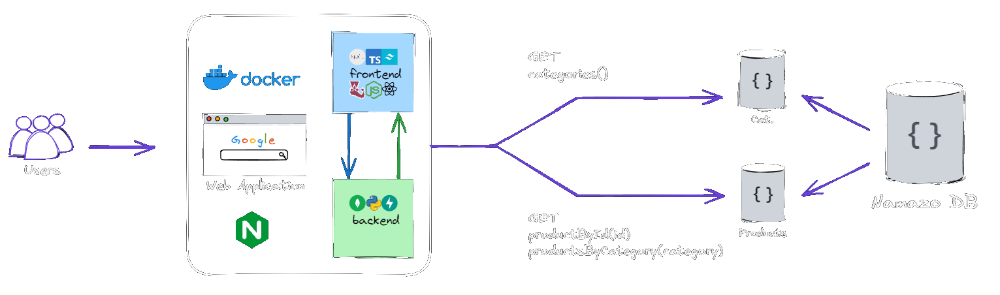

# namazo-commerce

  

Namazo is an ecommerce website built using Next.js, designed to be similar to Amazon. It allows users to search
for products based on category, and provides a list of categories with their corresponding product listings.

## Features

* **Product Search**: Users can search for specific products within a department using the top search bar.
* **Category Navigation**: A list of categories is provided, allowing users to browse through different sections
of the website.
* **Product Listings**: Each category has its own subsection displaying a list of products in well-formatted
cards. Cards include:
    - Product image
    - Price
    - Rating
    - Total reviews
* **Individual Product Pages**: Clicking on a product redirects users to the product's details page, where they
can view additional information.
* **Theme Switcher**: A button allows users to switch between light and dark modes.

## Current System

  

Containerized with Docker

* **Frontend**:
    - Next.js: For building the ecommerce website
    - Tailwind CSS: For styling and design
    - TypeScript: For type checking and coding standards
* **Testing**:
    - Jest: For unit testing

## Todos
- Add more categories with products
- Implement a search functionality for the entire site
- Add user authentication and personalization features
- Implement a shopping cart feature
- Integrate FastAPI backend with a MongoDB database to store product data
- Add animations and transitions for better UX

